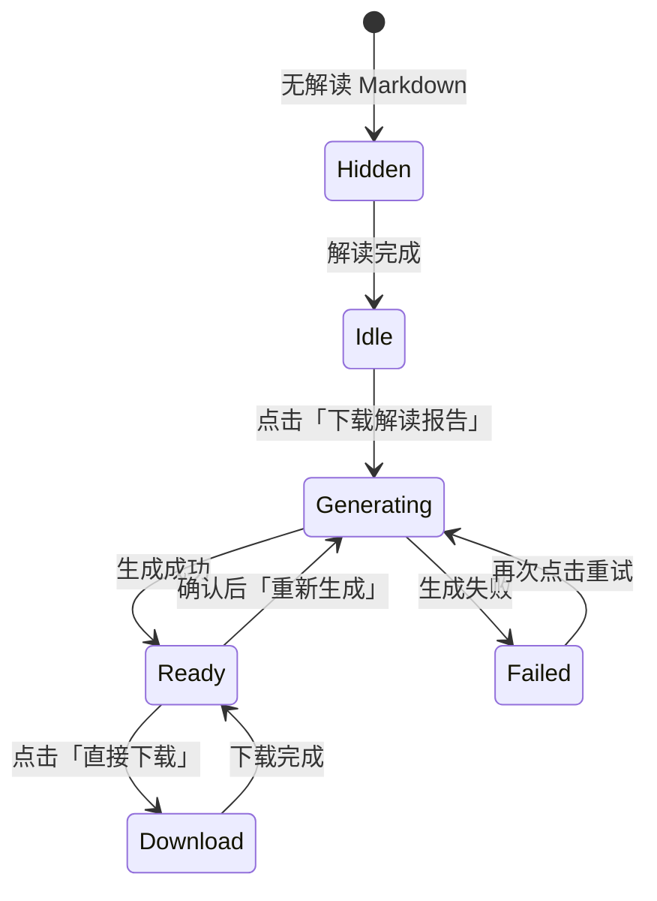

# 解读报告 HTML 按需生成设计

**日期：** 2026-07-23  
**状态：** 已批准（brainstorming 确认）  
**范围：** 强化页头「下载解读报告」——按需调用智能体，将解读 Markdown 转为参考样式的交互式单文件 HTML

---

## 1. 背景与目标

### 1.1 现状

- 解读阶段 `save_interpret_reports()` 会将 Markdown 简单转换为 HTML（标题 + 段落），样式与交互能力有限。
- 页头「下载解读报告」直接链接 `/api/tasks/{id}/interpret.html`，依赖上述自动生成的简单 HTML。
- 产品侧已有参考样式（`招标分析报告-*.html`）：8 个折叠卡片、风险分级、任务清单 checkbox、检查清单进度条等。

### 1.2 目标

1. **强化**现有页头「下载解读报告」按钮，不改变入口位置。
2. 解读阶段**仅保存 Markdown**；HTML **按需**由新智能体 + 固定模板生成。
3. 首次点击触发生成；已有文件后展示「直接下载」+「重新生成」（重新生成需确认）。
4. 用户最终下载**单个**自包含 HTML 文件（与参考样式一致）。

### 1.3 成功标准

1. 解读完成后 `interpret_html_path` 为空，直到用户触发生成。
2. 生成成功后 GET `/interpret.html` 返回参考结构的可交互 HTML。
3. 前端页头按钮随 `readiness` 正确切换四种状态。
4. 生成失败不影响解读/诊断主流程；保留已有 HTML（若曾成功生成）。

### 1.4 本期不做

- HTML 生成进度百分比（仅 lane_active 二元状态）
- 历史 HTML 版本保留
- 与诊断报告 DOCX 合并导出
- 离线/邮件发送 HTML

---

## 2. 方案选择

### 2.1 已确认决策

| 决策点 | 选择 |
|--------|------|
| 入口 | 强化页头现有按钮，不新增第二入口 |
| 解读阶段 HTML | 不再自动生成，只存 Markdown |
| 生成方式 | 智能体输出 JSON + 后端固定模板渲染（单文件 HTML） |
| 交互 | 异步任务 + 前端轮询（与 checklist 一致） |
| 重新生成 | 需 confirm 确认后覆盖 |

### 2.2 编排方案（推荐并已选）

**独立 `interpret_html_service`**（方案 A）：

- 后台 `asyncio.create_task` 执行生成
- `readiness` 增加 `interpret_html_ready` / `interpret_html_lane_active` / `interpret_html_error`
- **不改变** `task.status`

未选方案：接入 scheduler 主 lane（耦合过重）；FastAPI BackgroundTasks + 纯内存状态（重启丢状态）。

---

## 3. 用户流程



1. 解读完成 → 仅 `interpret.md` 落盘。
2. 用户点击「下载解读报告」→ POST → 按钮「HTML 生成中…」→ 2s 轮询 `getTask`。
3. 成功 → 「直接下载」+「重新生成」；失败 → 显示 `interpret_html_error`，可重试。
4. 「重新生成」→ `confirm('将覆盖已生成的 HTML 报告，是否继续？')` → POST 覆盖同路径文件。

---

## 4. 智能体

| 项 | 值 |
|---|---|
| 英文名 | `tender_interpret_html_report` |
| 应用名 | `tender_interpret_html_report_app` |
| 输入 | `interpret_report`（完整解读 Markdown，必填） |
| 输出 | JSON 对象（见 §5） |
| 模型 | 与现有解读/检查项同级（如 qwen3.6-flash，temperature 0.3） |
| 配置存档 | `docs/agents_config/tender_interpret_html_report.json` |
| 发布 | 实现阶段使用 agent-create-publish skill |

智能体**只输出结构化内容**，不生成 CSS/JS/HTML 标签。

---

## 5. JSON Schema（`schema_version: "1"`）

```json
{
  "schema_version": "1",
  "meta": {
    "title": "2026-2027年度慰问品采购项目 — 招标分析报告",
    "subtitle": "招标编号：DF-20260720-DF-04 | 截标：2026年7月27日 9:00",
    "project_key": "tender_DF20260720DF04"
  },
  "overview": {
    "rows": [
      {"label": "项目名称", "value": "…", "label2": "招标编号", "value2": "…"},
      {"label": "…", "value": "…", "colspan": 3}
    ]
  },
  "risks": [
    {"level": "high", "title": "★ …", "desc": "…"}
  ],
  "tasks": {
    "p0": [{"name": "…", "owner": "资质管理", "deadline": "2026-07-20"}],
    "p1": [],
    "p2": []
  },
  "checklist": [
    {
      "section": "资质文件",
      "items": ["营业执照副本复印件（加盖公章）"],
      "redline": false
    },
    {
      "section": "废标红线（必查）",
      "items": ["…"],
      "redline": true
    }
  ],
  "key_info": {
    "timeline": [
      {"label": "投标文件递交截止", "value": "…", "note": "…"}
    ],
    "qualification": [{"label": "营业执照", "value": "…"}],
    "commercial": [],
    "technical": []
  },
  "strategy": {
    "advantage": "1. …",
    "risk_avoid": "1. …",
    "price": "1. …"
  },
  "scoring": [
    {
      "dimension": "业绩",
      "score": "12分",
      "weight": "12%",
      "criteria": "…",
      "strategy": "…"
    }
  ]
}
```

### 5.1 字段约定

- `level`：`high | mid | low` → 参考 HTML 的 high/mid/low 样式
- `tasks.p0/p1/p2`：P0/P1/P2 任务组；空数组仍渲染组标题
- `checklist[].redline: true` → `.check-item.redline`
- `overview.rows`：两列四格或 `colspan: 3` 长行
- `meta.project_key`：模板 JS 用（默认 fallback：`tender_{task_id}`）
- **第 8 节「团队备注」**不在 JSON 中，固定模板提供空 `<textarea>`

### 5.2 富文本

`strategy.*` 等字段：后端 HTML-escape 后，仅允许白名单 `<strong>`、`<br>`（或拆分为字符串列表渲染）。

---

## 6. 固定 HTML 模板

模块：`backend/app/templates/interpret_html_report.py`（或等价路径）

- **固定**：参考文件全部 CSS、JS（`toggleCard`、`updateProgress`、checkbox 交互）、8 个 card 标题与图标、进度条、团队备注 textarea
- **动态**：topbar title/subtitle、各 card body 由 JSON 渲染
- **输出**：`render_interpret_html_report(data) -> str` → `{REPORT_DIR}/{task_id}/interpret.html`

---

## 7. 后端架构

### 7.1 模块

```
backend/app/
├── engine/
│   └── interpret_html_agent_os.py
├── services/
│   └── interpret_html_service.py
└── templates/
    └── interpret_html_report.py
```

### 7.2 API

| 方法 | 路径 | 说明 |
|------|------|------|
| POST | `/api/tasks/{id}/actions/generate-interpret-html` | 触发生成，202 |
| GET | `/api/tasks/{id}/interpret.html` | 下载 HTML（沿用） |

**POST 前置：** `interpret_md_path` 可读；`interpret_html_lane_active == false`  
**冲突：** 409  
**响应：** `{ "task_id": "...", "status": "generating_interpret_html" }`

### 7.3 生成流程

```
POST → interpret_html_service.start(task_id)
  → lane_active = true
  → asyncio.create_task(_run)
      → 读 interpret.md
      → AgentOSInterpretHtmlAgent.invoke
      → Pydantic validate JSON
      → render_interpret_html_report
      → 写 interpret.html
      → 更新 task.interpret_html_path
      → artifact.sync
      → lane_active = false, clear error
  失败 → interpret_html_error, lane_active = false（不覆盖 interpret_html_path）
```

### 7.4 readiness 扩展

`TaskReadinessOut` 新增：

| 字段 | 含义 |
|------|------|
| `interpret_html_ready` | `interpret_html_path` 文件存在 |
| `interpret_html_lane_active` | 生成进行中 |
| `interpret_html_error` | 最近失败原因（成功时 null） |

### 7.5 解读阶段变更

- `save_interpret_reports()` 仅写 `interpret.md`
- `scheduler.py` 解读完成后**不**设置 `interpret_html_path`
- 删除解读链路中对 `markdown_to_html_document()` 的调用（函数可保留供测试或后续复用）

### 7.6 配置

- `interpret_html_app_name = "tender_interpret_html_report_app"`
- `interpret_html_invoke_timeout_seconds = 600`

---

## 8. 前端

### 8.1 改动

- `TaskDetailPage.jsx`：页头按钮状态机
- `api.js`：`generateInterpretHtml(id)`

### 8.2 状态 UI

| 条件 | UI |
|------|-----|
| 无 `interpret_markdown` | 隐藏 |
| `interpret_html_lane_active` | 「HTML 生成中…」禁用 |
| `interpret_html_ready` | 「直接下载」+「重新生成」 |
| 有 markdown、未 ready | 「下载解读报告」 |
| `interpret_html_error` | 错误提示 |

### 8.3 轮询

`interpret_html_lane_active === true` 时沿用现有 2s `load(true)`。

---

## 9. 错误处理

| 场景 | 行为 |
|------|------|
| 无 Markdown | POST 404 |
| 重复 POST | 409 |
| Agent/解析/渲染失败 | 设 `interpret_html_error`；保留旧 HTML |
| GET 无文件 | 404 |
| 服务重启 mid-generation | lane 丢失，用户可重新 POST |

---

## 10. 测试计划

**单元：** render、agent 解析、service 编排、更新 `test_interpret_report` / `test_scheduler` / `test_report`

**集成：** POST 202 → ready → GET html；重生成覆盖；无 markdown 404

**手动：** 四种按钮状态 + 重新生成 confirm

---

## 11. 参考

- 样式参考：效果调优样例 `招标分析报告-2026-2027年度慰问品采购项目.html`（8 卡片交互结构）
- 现有 Agent 模式：`backend/app/engine/checklist_agent_os.py`
- 现有 readiness：`backend/app/services/task_readiness.py`
